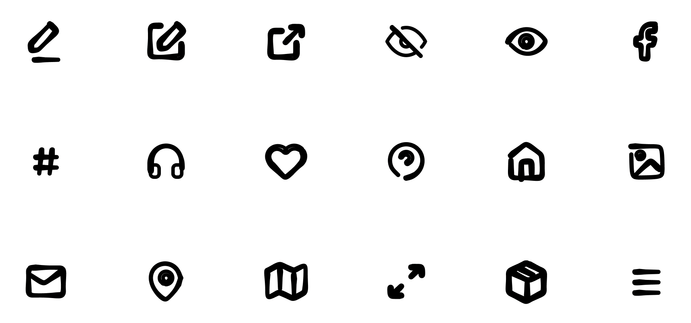

# 

Draw perfect pressure-sensitive freehand lines.

🔗 Curious? Try out a [demo](https://perfect-freehand-example.vercel.app/).

💅 Designer? Check out the [Figma Plugin](https://www.figma.com/community/plugin/950892731860805817).

🕊 Flutterer? There's now a [dart version](https://pub.dev/packages/perfect_freehand) of this library, too.

💕 Love this library? Consider [becoming a sponsor](https://github.com/sponsors/steveruizok?frequency=recurring&sponsor=steveruizok).

## Table of Contents

- [Installation](#installation)
- [Usage](#usage)
- [Documentation](#documentation)
- [Community](#community)
- [Author](#author)

## Installation

```bash
npm install perfect-freehand
```

or

```bash
yarn add perfect-freehand
```

## Introduction

This package exports a function named `getStroke` that will generate the points for a polygon based on an array of points.


To do this work, `getStroke` first creates a set of spline points (red) based on the input points (grey) and then creates outline points (blue). You can render the result any way you like, using whichever technology you prefer.

[](https://codesandbox.io/s/perfect-freehand-example-biwyi?fontsize=14&hidenavigation=1&theme=dark)

## Usage

To use this library, import the `getStroke` function and pass it an array of **input points**, such as those recorded from a user's mouse movement. The `getStroke` function will return a new array of **outline points**. These outline points will form a polygon (called a "stroke") that surrounds the input points.

```js
import { getStroke } from 'perfect-freehand'

const inputPoints = [
  [0, 0],
  [10, 5],
  [20, 8],
  // ...
]

const outlinePoints = getStroke(inputPoints)
```

You then can **render** your stroke points using your technology of choice. See the [Rendering](#rendering) section for examples in SVG and HTML Canvas.

You can **customize** the appearance of the stroke shape by passing `getStroke` a second parameter: an options object containing one or more options. See the [Options](#options) section for a full list of available options.

```js
const stroke = getStroke(myPoints, {
  size: 32,
  thinning: 0.7,
})
```

The appearance of a stroke is effected by the **pressure** associated with each input point. By default, the `getStroke` function will simulate pressure based on the distance between input points.

To use **real pressure**, such as that from a pen or stylus, provide the pressure as the third number for each input point, and set the `simulatePressure` option to `false`.

```js
const inputPoints = [
  [0, 0, 0.5],
  [10, 5, 0.7],
  [20, 8, 0.8],
  // ...
]

const outlinePoints = getStroke(inputPoints, {
  simulatePressure: false,
})
```

In addition to providing points as an array of arrays, you may also provide your points as an **array of objects** as show in the example below. In both cases, the value for pressure is optional (it will default to `.5`).

```js
const inputPoints = [
  { x: 0, y: 0, pressure: 0.5 },
  { x: 10, y: 5, pressure: 0.7 },
  { x: 20, y: 8, pressure: 0.8 },
  // ...
]

const outlinePoints = getStroke(inputPoints, {
  simulatePressure: false,
})
```

**Note:** Internally, the `getStroke` function will convert your object points to array points, which will have an effect on performance. If you're using this library ambitiously and want to format your points as objects, consider modifying this library's `getStrokeOutlinePoints` to use the object syntax instead (e.g. replacing all `[0]` with `.x`, `[1]` with `.y`, and `[2]` with `.pressure`).

## Example

```jsx
import * as React from 'react'
import { getStroke } from 'perfect-freehand'
import { getSvgPathFromStroke } from './utils'

export default function Example() {
  const [points, setPoints] = React.useState([])

  function handlePointerDown(e) {
    e.target.setPointerCapture(e.pointerId)
    setPoints([[e.pageX, e.pageY, e.pressure]])
  }

  function handlePointerMove(e) {
    if (e.buttons !== 1) return
    setPoints([...points, [e.pageX, e.pageY, e.pressure]])
  }

  const stroke = getStroke(points, {
    size: 16,
    thinning: 0.5,
    smoothing: 0.5,
    streamline: 0.5,
  })

  const pathData = getSvgPathFromStroke(stroke)

  return (
    <svg
      onPointerDown={handlePointerDown}
      onPointerMove={handlePointerMove}
      style={{ touchAction: 'none' }}
    >
      {points && <path d={pathData} />}
    </svg>
  )
}
```

> **Tip:** For implementations in Typescript, see the example project included in this repository.

[](https://codesandbox.io/s/perfect-freehand-example-biwyi?fontsize=14&hidenavigation=1&theme=dark)

## Documentation

### Options

The options object is optional, as are each of its properties.

| Property           | Type     | Default | Description                                           |
| ------------------ | -------- | ------- | ----------------------------------------------------- |
| `size`             | number   | 8       | The base size (diameter) of the stroke.               |
| `thinning`         | number   | .5      | The effect of pressure on the stroke's size.          |
| `smoothing`        | number   | .5      | How much to soften the stroke's edges.                |
| `streamline`       | number   | .5      | How much to streamline the stroke.                    |
| `simulatePressure` | boolean  | true    | Whether to simulate pressure based on velocity.       |
| `easing`           | function | t => t  | An easing function to apply to each point's pressure. |
| `start`            | { }      |         | Tapering options for the start of the line.           |
| `end`              | { }      |         | Tapering options for the end of the line.             |
| `last`             | boolean  | true    | Whether the stroke is complete.                       |

**Note:** When the `last` property is `true`, the line's end will be drawn at the last input point, rather than slightly behind it.

The `start` and `end` options accept an object:

| Property | Type              | Default | Description                                                                              |
| -------- | ----------------- | ------- | ---------------------------------------------------------------------------------------- |
| `cap`    | boolean           | true    | Whether to draw a cap.                                                                   |
| `taper`  | number or boolean | 0       | The distance to taper. If set to true, the taper will be the total length of the stroke. |
| `easing` | function          | t => t  | An easing function for the tapering effect.                                              |

**Note:** The `cap` property has no effect when `taper` is more than zero.

```js
getStroke(myPoints, {
  size: 8,
  thinning: 0.5,
  smoothing: 0.5,
  streamline: 0.5,
  easing: (t) => t,
  simulatePressure: true,
  last: true,
  start: {
    cap: true,
    taper: 0,
    easing: (t) => t,
  },
  end: {
    cap: true,
    taper: 0,
    easing: (t) => t,
  },
})
```

> **Tip:** To create a stroke with a steady line, set the `thinning` option to `0`.

> **Tip:** To create a stroke that gets thinner with pressure instead of thicker, use a negative number for the `thinning` option.

### Other Exports

For advanced usage, the library also exports smaller functions that `getStroke` uses to generate its outline points.

#### `getStrokePoints`

A function that accepts an array of points (formatted either as `[x, y, pressure]` or `{ x: number, y: number, pressure: number}`) and (optionally) an options object. Returns a set of adjusted points as `{ point, pressure, vector, distance, runningLength }`. The path's total length will be the `runningLength` of the last point in the array.

```js
import { getStrokePoints } from 'perfect-freehand'
import samplePoints from "./samplePoints.json'

const strokePoints = getStrokePoints(samplePoints)
```

#### `getOutlinePoints`

A function that accepts an array of points (formatted as `{ point, pressure, vector, distance, runningLength }`, i.e. the output of `getStrokePoints`) and (optionally) an options object, and returns an array of points (`[x, y]`) defining the outline of a pressure-sensitive stroke.

```js
import { getStrokePoints, getOutlinePoints } from 'perfect-freehand'
import samplePoints from "./samplePoints.json'

const strokePoints = getStrokePoints(samplePoints)

const outlinePoints = getOutlinePoints(strokePoints)
```

**Note:** Internally, the `getStroke` function passes the result of `getStrokePoints` to `getStrokeOutlinePoints`, just as shown in this example. This means that, in this example, the result of `myOutlinePoints` will be the same as if the `samplePoints` array had been passed to `getStroke`.

#### `StrokeOptions`

A TypeScript type for the options object. Useful if you're defining your options outside of the `getStroke` function.

```ts
import { StrokeOptions, getStroke } from 'perfect-freehand'

const options: StrokeOptions = {
  size: 16,
}

const stroke = getStroke(options)
```

## Tips & Tricks

### Freehand Anything

While this library was designed for rendering the types of input points generated by the movement of a human hand, you can pass any set of points into the library's functions. For example, here's what you get when running [Feather Icons](https://feathericons.com/) through `getStroke`.



### Rendering

While `getStroke` returns an array of points representing the outline of a stroke, it's up to you to decide how you will render these points.

The function below will turn the points returned by `getStroke` into SVG path data.

```js
const average = (a, b) => (a + b) / 2

function getSvgPathFromStroke(points, closed = true) {
  const len = points.length

  if (len < 4) {
    return ``
  }

  let a = points[0]
  let b = points[1]
  const c = points[2]

  let result = `M${a[0].toFixed(2)},${a[1].toFixed(2)} Q${b[0].toFixed(
    2
  )},${b[1].toFixed(2)} ${average(b[0], c[0]).toFixed(2)},${average(
    b[1],
    c[1]
  ).toFixed(2)} T`

  for (let i = 2, max = len - 1; i < max; i++) {
    a = points[i]
    b = points[i + 1]
    result += `${average(a[0], b[0]).toFixed(2)},${average(a[1], b[1]).toFixed(
      2
    )} `
  }

  if (closed) {
    result += 'Z'
  }

  return result
}
```

To use this function, first run your input points through `getStroke`, then pass the result to `getSvgPathFromStroke`.

```js
const outlinePoints = getStroke(inputPoints)

const pathData = getSvgPathFromStroke(outlinePoints)
```

You could then pass this string of SVG path data either to an [SVG path](https://developer.mozilla.org/en-US/docs/Web/SVG/Attribute/d) element:

```jsx
<path d={pathData} />
```

Or, if you are rendering with HTML Canvas, you can pass the string to a [`Path2D` constructor](https://developer.mozilla.org/en-US/docs/Web/API/Path2D/Path2D#using_svg_paths)).

```js
const myPath = new Path2D(pathData)

ctx.fill(myPath)
```

### Flattening

By default, the polygon's paths include self-crossings. You may wish to remove these crossings and render a stroke as a "flattened" polygon. To do this, install the [`polygon-clipping`](https://github.com/mfogel/polygon-clipping) package and use the following function together with the `getSvgPathFromStroke`.

```js
import polygonClipping from 'polygon-clipping'

function getFlatSvgPathFromStroke(stroke) {
  const faces = polygonClipping.union([stroke])

  const d = []

  faces.forEach((face) =>
    face.forEach((points) => {
      d.push(getSvgPathFromStroke(points))
    })
  )

  return d.join(' ')
}
```

## Development & Contributions

To work on this library:

- clone this repo
- run `yarn` in the folder root to install dependencies
- run `yarn start` to start the local development server

The development server is located at `packages/dev`. The library and its tests are located at `packages/perfect-freehand`.

Pull requests are very welcome!

## Community

### Support

Need help? Please [open an issue](https://github.com/steveruizok/perfect-freehand/issues/new) for support.

### Discussion

Have an idea or casual question? Visit the [discussion page](https://github.com/steveruizok/perfect-freehand/discussions).

### License

- MIT
- ...but if you're using `perfect-freehand` in a commercial product, consider [becoming a sponsor](https://github.com/sponsors/steveruizok?frequency=recurring&sponsor=steveruizok). 💰

## Author

- [@steveruizok](https://twitter.com/steveruizok)
